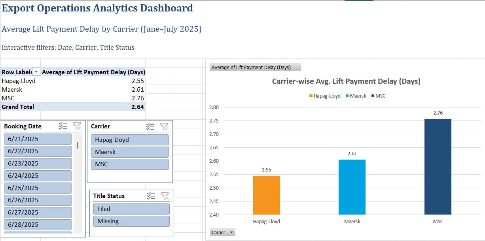

# Export Operations Dashboard – Cargoloop

📦 **Project Type:** Logistics Operations  
🛠 **Tools Used:** Excel, PivotTables, Bar Charts, Slicers  
📊 **Business Goal:** Reduce lift payment delays and improve vendor accountability  

---

## 📌 Overview
Analyzed export operation data to compare lift payment delays across major shipping carriers (MSC, Maersk, Hapag-Lloyd). Built an interactive Excel dashboard using pivot tables and slicers.

---

## 🎯 Objective
Help the Cargoloop operations team identify which carrier delays payments most frequently and take action to reduce delay-related costs.

---

## 📊 Key Insights
- MSC had the highest average lift payment delay (2.76 days).
- Hapag-Lloyd was the fastest, averaging 2.55 days.
- Interactive filters allow drilling by **date**, **title status**, and **carrier**.

---

## 💡 Recommendations
- Prioritize automation or follow-up reminders for MSC.
- Monitor weekly metrics to track improvements.
- Share this dashboard with dispatch and billing teams to align actions.

---

## 🖼️ Dashboard Snapshot

---

## 🧠 Skills Demonstrated
- Excel dashboarding
- Pivot Table analysis
- Business communication through data storytelling
